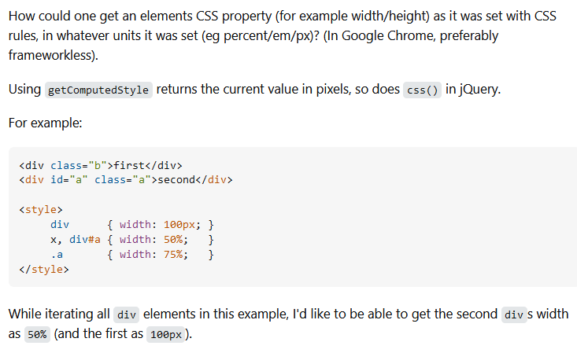

## The Importance of Acting SMART

SMART questions are essential not only for software engineers who want to solve problems efficiently and contribute to the collective knowledge of their field but also for any other field. It is not solely about asking SMART questions but about working SMART, which involves making your best effort to solve your issue before asking a question. If an issue persists, then by formulating SMART questions, engineers demonstrate a commitment to problem-solving and respect for others' time and expertise. This essay explores why SMART questions are crucial. It examines how specific examples of questions fulfil or fail to meet the criteria for SMART questions and reflects on the insights gained from this evaluation.

## Why

First and foremost, SMART questions bring a sense of efficiency to problem-solving. They streamline the troubleshooting process by clearly defining the problem, outlining the steps already taken, and specifying the context. Clarity in questioning reduces redundant efforts and accelerates finding solutions, making the process more productive and effective.

Besides efficiency, learning from a situation is the best boon. By articulating problems clearly and documenting what has been attempted, engineers and others contribute to a learning process that benefits themselves and the community. This documentation helps in understanding common issues and their resolutions or lack thereof. Well-asked questions contribute to the knowledge base available to the broader community. They become reference points for others facing similar problems, thus creating a collaborative effort and gain.

Others should also be taken into consideration when asking a question. Providing a well-structured question shows respect for the time and effort of those who might help. It ensures that responders do not have to dig through vague or incomplete information, leading to more focused and practical assistance.

## Analysis of Questions on StackOverflow

The [SMART](https://stackoverflow.com/questions/9730612/get-element-css-property-width-height-value-as-it-was-set-in-percent-em-px-et) question  I found was about getting an element's CSS property value as it was set in various units. The question provides a specific example with code and describes what has been attempted using getComputedStyle and css(). The mention of the Chrome Inspector is particularly useful for understanding the context.

As mentioned, the question includes sample HTML and CSS code, which clarifies the issue. It shows a level of detail about the problem and what is expected. The user demonstrates learning by referring to existing methods and noting what did not work. The question is specific about the desired outcome (getting the original unit's value) and the current methods' issue. The question is well done, but they could improve by including the exact problem with any relevant browser or environment-specific details.

The [non-SMART](https://stackoverflow.com/questions/53172241/spark-2-3-0-giving-error-provider-org-apache-spark-ml-source-libsvm-libsvmfile) question I found is about Spark 2.3.0, and the error with LibSVMFileFormat fails to hit a few of the key points of a SMART question. The question was never answered. 

The question needs more details about what was done to resolve the issue before posting. It only provides the error message and some code snippets without indicating any troubleshooting steps. There is no indication of prior debugging. The user does not mention perusing documentation or trying any solutions. The error message is clear, but the question needs to explain the conditions in place further. Doing so would make it easier to provide a targeted solution. Later, another user had the same issue and posted a reply to the question. The author had found a solution and shared it when asked. A significant positive to having a community is having a collaborative network. Finding a solution to an issue you had that was not resolved is critical for us to grow as a community.

## Insights Gained

Through evaluating these questions, it becomes clear that the quality of a question could affect the efficiency and quality of problem resolution. Having a well-structured question not only aids in quicker solutions but also contributes positively to the community by serving as a reference for similar issues. These questions highlight the importance of providing comprehensive details, documenting efforts, and being specific about issues.
Furthermore, this exercise features the value of continuous learning and exploration in problem-solving. By showing what has been tried and understanding the context, others can make the process of seeking help more productive and mutually beneficial.
    
Acting SMART is crucial to effective problem-solving and knowledge sharing in software engineering. It helps address issues efficiently, facilitates learning, and respects the community's contributions.