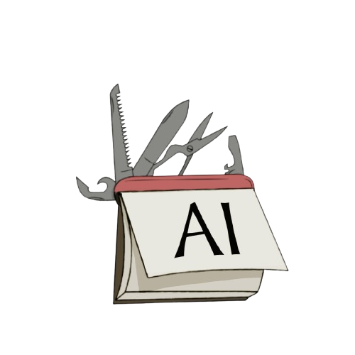

  
   
  > "AI as enablers, not as the solution" ~ Jayden 2024

In Academia, I have personally seen a dramatic rise in AI use for student assistance. This is not only found in the Computer Science (CS) major but in multiple majors. In the CS major, AI is commonly used to explain, write, debug, test, and fix student code. I have used ChatGPT and Co-Pilot.

___

# Personal Experiences

In general, I have used AI numerous times. This is not limited to 'ICS 314: Software Engineering I', but in other classes and other facets of life. However, I balance the use of AI with personal effort.

### Workout of the Day (WOD)

In ICS 314 I did not use AI for the at-home WODs we had as homework. Besides experiencing and learning the material first-hand, I desired to try to personally limit test myself. I did this to prove to myself that I could learn the material and put it into practise without AI assistance.

For the in-class WODs, we had practise WODs and ones that were graded. In the first couple of sets of WODs, I did not use AI. After that, I gradually began to think that it did not matter if I used AI or not. I began thinking like this because the graded WODs reflected the at home-WODs very well. Since I did the at-home WODs with minimal AI and learnt/understood the course content, I did not feel any guilt in using AI to breeze through it in class. 

Once we started to create websites, I dialled down my use of AI even on the in-class WODs. This was because I felt like with how much more we were learning, it was better to have the additional practise. However, if I had significant issues in a graded WOD, I was not shy in using AI to solve them. When this happened, I took note of what the issue was, so that I could reflect on it later.

### Essays

Much like this essay, we wrote a few essays for ICS 314. I made general use of AI in the planning of an essay, but I am not using AI for this essay at all.

In previous essays, I used AI to help me obtain information that I could use as content for the essay. For example, I would give it a generally fleshed idea I wanted to talk about. Then I would tell it to ask me any further questions. I did this to try and expand the depth of the essay. I also used AI to organise the format and flow of ideas that I had for the essay. As for text generation, I only ever asked it to give me relevant tags. That I could add to the given essay.

### Final Project

I used AI significantly when working on the final project. One task I used AI frequently for was reorganising elements. This was especially prevalent in the second stage of the final project due to frequent additions, subtractions, or a change in the layout or implementation of the application.

Sometimes I did it manually which allowed me to play with the layout personally. This gave rise to another situation I would use AI; to help clean the code up. Occasionally, there would be leftover artefacts in the code, changes in indentations, etc. In such situations, I used AI to clean up the code, even more so for the more mundane tasks like fixing indentation. 

### Learning Concepts

Using AI to learn in ICS 314 and in general played out well for me. Not always will the teacher, teacher's assistant, tutor, or another student be able to reply promptly. Having someone to have a back-and-forth with at your beck and call is a strong resource when stuck in a rut.

### Asking and Answering Questions

I did not make use of AI to answer anyone's questions in class or on the class Discord server.

However, I did make use of it to answer my questions. The difficulty of answering questions correctly seemed to scale with the size of the project. What helped to mitigate this was asking smart questions. Asking ChatGPT smart questions immediately showed results in efficiency and effectiveness. Giving ChatGPT a run down and background information helped to reduce the amount of rabbit holes it would take.

This makes sense, as you see similar results when asking other people for help. Asking SMART questions rather than regular questions [boosts the chances of receiving more efficient and effective help.](https://jaydenontalancapistrano.github.io/essays/acting-smart.html)

When it comes to coding examples, I do not recall asking AI to give me them. When it came to this, I was fairly strict on ChatGPT not sending me code when I asked questions. Seeing a coded example did not seem to give me significant growth. I preferred to think about implementations on my own.

ChatGPT did a great job at decrypting lines of code that I had trouble trying to understand. However, I think it was rare for me to ask AI to explain code to me for this class. If you have a foundational understanding, then you should be able to read the code well without assistance. I primarily used ChatGPT to explain code outside of the class, when doing self-studying and self-projects where I built off of other people's codes.

### Writing code

I did not use AI extensively to generate code for me, especially for more significant functions--except during the final project. The times I used AI to generate code were more tedious and mundane coding tasks. For example, test cases and HTML document structure--basic head and body skeleton.

### Documenting code

When documenting code I preferred to do so myself. The way I understand it and the way AI "understand" it can be very different.   By documenting code, it also gives me the chance to reflect on what I am trying to do with my code--how and why I do it. By not documenting your code, I think that you miss out on reflecting on what you learnt. Since I believed in that, I did not use AI to document my code. 

## Quality assurance

As mentioned previously, I used AI to help clean up my code during the final project. Besides that, I also sometimes asked it to rate or grade my code, and to give suggestions on improving my code.

___

# Impact on Learning and Understanding

Thinking about it, ChatGPT may have hindered my research skills from further developing. However, in tandem, it has also allowed me to branch out much more broadly in terms of topics that I can be interested in. ChatGPT's effectiveness within seconds of a prompt is stunningly helpful when trying to expose yourself to a new topic. At times, it can also assist in learning more deeply about other topics.

With that in mind, I think that it widens the field of skills you can develop. Being able to have a 1:1 back and forth with "someone" is a valuable resource to have when developing skills. The power of a 1:1 discussion is the exchange of ideas. Something said by another being can assist in comprehending a concept. This is something that I have experienced while using ChatGPT numerous times. Overall, the use of AI has not only broadened my understanding and scope of software engineering but elsewhere too.

___

# Practical Applications

AI is used widely, you likely can integrate AI somehow into every part of your life. For health, some apps use AI to customise meal plans based on your preferences and goals.

For Software Engineer (SWE), AI is already integrated into many IDEs like Visual Studio Code (VSC). To say the least, I was baffled when it was trying to give me an entire function without me asking. I had not expected that to be a feature at the time. 

Besides that, AI is an incredible resource for many SWEs due to other reasons. As mentioned above I extensively used AI to create test cases. I expect that in the real world, this use case would be rather common for SWEs. There are also AIs that are able to debug code and make code reviews. 

___

# Challenges and Opportunities

It was already noted earlier, but the difficulty of utilising AI scaled with the size of the project. I do not think that this is much of an issue as it is a challenge and opportunity--a skill and knowledge check.

Notably, asking SMART questions yielded effective results, even when the scale of a project was big. That is one element I have in mind when I say there are some skill and knowledge checks for effectiveness. If you do not know anything at all about the code you are writing, it will be increasingly more difficult for you to produce workable code. At times an AI may loop back to its previous answer incorrectly and fall into its little rabbit hole. 

Trying to make further progress from that point requires you to fidget around blindly in hopes of making progress. Yet, it changes if you have applicable foundational knowledge and skills in the code you are trying to produce.

___

# Comparative Analysis:

Generally speaking, AI may be rather harmful as opposed to traditional teaching methods. However, it is also rather difficult to compare the two. How are we supposed to consider the self-responsibility a student has to actually utilise AI to learn rather than to breeze through things? Similarly, teachers do not have a set quality to them. Some teachers can explain concepts very well and others may find it more difficult.

This idea can also further extend into teaching styles, class styles, etc. For example, in a class of 32 students, how many would get to experience the 1:1 engagement that they would "require"? With an AI like ChatGPT, you get 1:1 engagement at all times.

When it comes to knowledge retention, I think that neither AI nor traditional teaching methods matter more than self-practise. In terms of CS, it would be the equivalent of working on a project or Leetcode. You could count homework from traditional teaching methods, but there is nothing stopping someone from asking an AI to similarly give them a project to work on. Personally, it is the same for practical skills development. 

___

# Future Considerations

The biggest challenge I see for peers and underclassmen struggling with most will be self-responsibility in learning course content rather than depending on AI. Presently, this is already an issue that I am seeing. However, it can still become increasingly worse. That is similarly something that people would need to work on in the future, using AI as a resource rather than as a tool.

# Conclusion

To me, the use of AI is on the fence. As presented by the beginning quote,  I think it comes down to whether it is used to enable a student to improve, or simply used as a means to an end. It is rather detrimental when you are able to rely on a single tool like AI rather than learning and understanding the material. At the very least, I would hope that people--including myself--can remain responsible enough to practise the material without assistance, and to build a foundational base for our careers as SWEs. 
