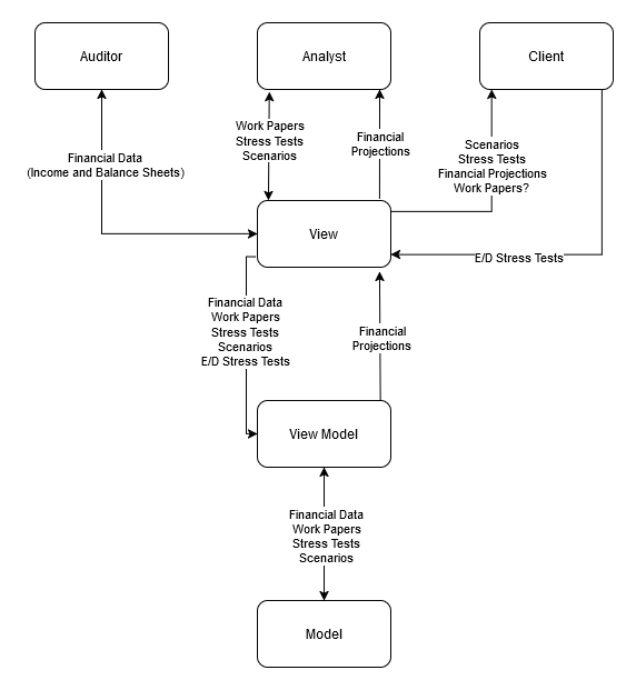
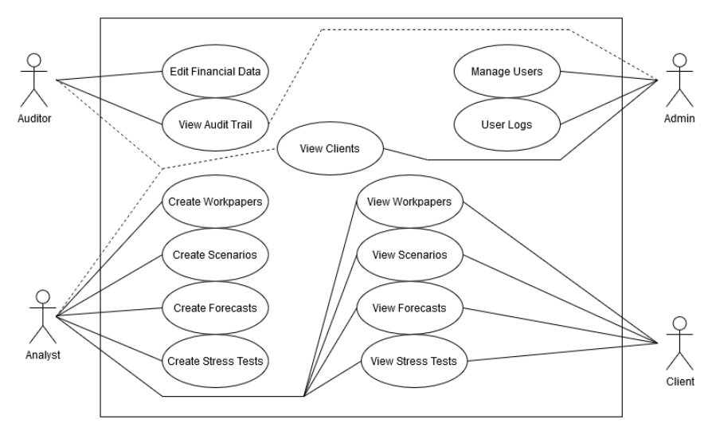

In ICS 414: Software Engineering II, we worked with a real-world customer--Spire, a financial consulting firm--that wanted to move beyond spreadsheets and toward a web application that could provide forecasts, stress test scenarios, and store data at a company level. We were entrusted with building an app that could make sense of their financial models and allow analysts to simulate various economic scenarios, all while keeping user experience in mind.

On paper, I was a back-end developer. But in practice, I found myself stepping up to a project management role as well--deliberately. I cared about how each part connected. Not just from an engineering standpoint, but also from a systems perspective. I created architecture diagrams, use case flows, and explanation decks to help unify the back-end team's understanding of what we were building. Questions flew, and I found myself clarifying logic, helping teammates, and making architectural decisions.

## Front-End vs Back-End

One of the semi-early concerns that came up--voiced by our Professor--was our team's decision to split development between front-end and back-end. I get what he was thinking--strictly dividing can lead to fragmentation as a team, mismatched expectations, and bugs from broken logic, rather than misalignment.

An example would be the forecast architecture. I designed it around year-based structures to support the requirement for dynamic 4, 8, and 12-year forecasts. Meanwhile, the frontend chose to organise forecasts by field. I cannot say either of us was wrong. However, I would not even call it wrong--or a mistake. If anything, it gave us an honest taste of how fractured communication can play out in real-world developer environments--especially ones that mirror the frontend and backend split. 

I absolutely understand our professor's caution about splitting roles, but I also believe it was an experience worth having. It may have been easier to just split the app into sections for everyone to work on, but I also would not have been able to experience, enjoy, and profit as much as I did by being able to do what I wanted in the project.

## Calculation Implementation

The forecasting is meant to support both multiplier and 3-year average forecasts based on past data, and the analyst could switch this dynamically for each field. I had studied the client's spreadsheet in depth--thanks in part to my experience working with [spreadsheets](https://jaycapist.github.io/projects/spreadsheetcalculator.html)--and reverse-engineered the formulae into TypeScript logic. This meant mapping levels of calculations across multiple files, handling edge cases like division by zero, unexpected/expected input, and ensuring that the data matched the intended output. I say intended output because the spreadsheet admittedly had a few issues.

Later, I extended this logic to support residual effects and stress effects from economic stress tests. That meant writing modular utility functions that could compare baseline vs stressed scenarios for cases like drops in revenue, spikes in expenses, or interest rate shifts and APIs. Stress tests required integrating inputs and calculations projected across a forecast, while having validated safety and guarding against field pollution. Calculation file-wise, I wrote all but one file from the ground up myself. It was heavy work, but it gave me a sense of ownership--over the code and the architecture.

## Project Management

From the start of the project, I wanted to be the one who thought up the system. Originally, we had limited alignment, but I drew diagrams, created reference sheets, and simplified flow expectations to establish a common understanding. I worked to onboard the team on possible expectations, especially when we were the most unsure of how the end product would end up. Truthfully, I had not always gotten it right--I was not able to totally control the dissonance. However, I felt the responsibility to catch and organise what we needed and stepped up to that plate.

For example, the diagram below is the earliest version of several attempts to visualise architecture the application.

  <strong style="font-size: 24px; padding-top: 24px;">Architecture Diagram</strong>
   
  

The diagram below is the a use case diagram that I made before we discussed user stories. Quite honestly, looking at these early diagrams now if I were to re-create them--they would be totally different.

  <strong style="font-size: 24px; padding-top: 24px;">Use Case Diagram</strong>
   
  

## What I Learnt

- **Assumptions can cost you**: You cannot assume your team sees the project like you do. Communicate visually, verbally, and structurally--in any way possible so that there can be mutual understandings.
- **Project management is more than coordination**: Sometimes it is making decisions so the team can move forward. Sometimes, it is being the one who moves--even when everyone else is still.
- **Ownership is not assigned**: It is assumed. I cared because I knew what it could be--and wanted to see that.
- **Carrying too much**: Near the end, I was at the edge of burning out--more tasks were starting to shift to me, but I ended up drawing a line. It is not that I could not take it on or that I did not want to, but because I finally realised I should not have to.

## Conclusion

This project stretched me in code and patience. There were definitely stressful moments. Bugs found too late. PRs merged under pressure, PRs not merged for weeks. But what stayed with me most was not the code—it was what it meant to step up. To give shape to something. That is something that I want to keep doing. Maybe next time, with even clearer alignment and no stacked PRs.

## Going Forward

I actually plan to further work on this project without "Team Tres". I asked the orginial team members and they had no issues with me continuing on with the project. I plan to further refine things into how I would idealy want the web application to be. I also plan to potentially throw some underclassmen friends at the front-end so that they can get some experience with it.