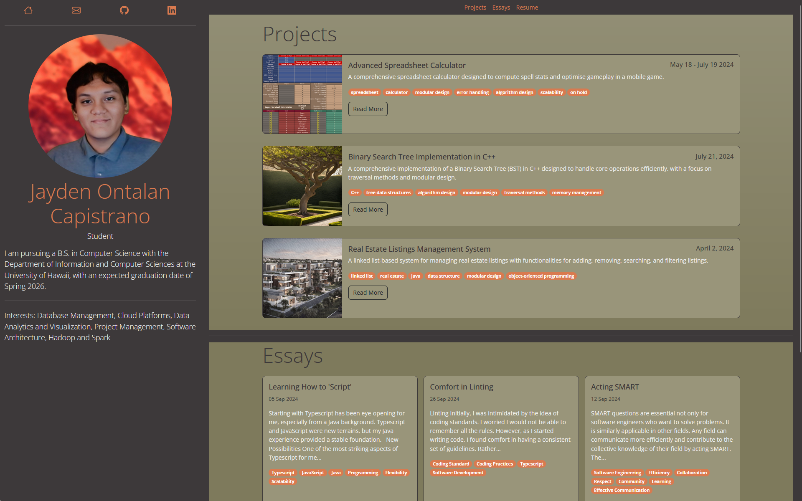
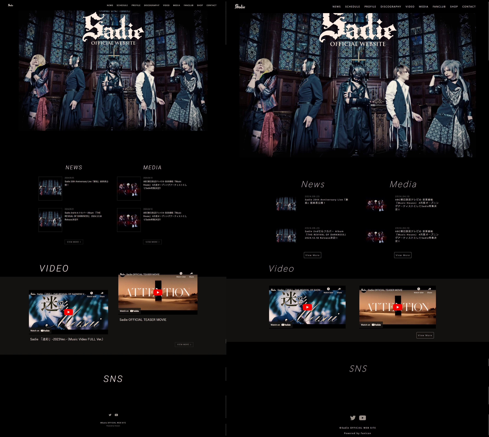

User interface (UI) frameworks are mighty assistive tools for developers seeking to create attractive and responsive web applications. Among these, Bootstrap 5 stands out for its flexibility. Learning a new framework is as daunting as learning a new programming language, and the investment may or may not pay off. If it does, then that introduces the developer to an extensive way to more efficiently customise their website.

# Considerations

People debate with themselves about whether one thing is worth a time investment. UI frameworks are similarly considered like so. What should make you consider using a UI Framework, let alone which UI Framework to use?

## Ease of Development:

Like Bootstrap 5, frameworks often have components you can build your site with--eg. navigation bars, buttons, etc. The development process is then simplified and less complex. This allows the developer to spend more time on larger and more complex implementations.

## Simplicity:

This was mentioned previously, but it helps to simplify the overall development process. I think that simplifying the development process extends further. Simplifying the process has many benefits. For example, using built-in components means there are fewer chances of having inconsistencies. As said earlier,  it also saves time. It extends to having more resources to clean up and manage overall code. In fact, with simplicity, you will also have more freedom to play around with different designs. I think that is a heavy point to take into consideration.

## Digestibility:

Bootstrap 5 particularly offers an easily digestible and customisable grid system to build off of. I had used Bootstrap 5 as early as when my class created our professional portfolios. It was very easy to digest and understand, even if I only went so deep when using it. It worked well when helping me to resize elements for desktop and mobile. I noticed that I did not need to use @media queries to do things, which was interesting. It seemed like it would be a lot easier.

  

# Closing Thoughts

Bootstrap 5 is challenging but very rewarding. With a background focused primarily on back-end development, the transition to front-end work in ICS314: Software Engineering was refreshing. Bootstrap felt similar to experiencing a new language—it felt as though it expanded the possibilities of designs.

A steep learning curve should never dissuade someone from learning anything--that is what I personally think. It is not like I had an easy time trying to learn Bootstrap 5. I especially struggled a lot with joining CSS and Bootstrap 5. Bootstrap has built-in CSS that created specificity challenges for me, leading to frustration as I tried to determine why some elements were styled a certain way. Is it the margin? Padding? Wait it is neither? Where is it coming from, is it from inheritance? Navigating these challenges forced me to deepen my understanding of HTML and CSS, ultimately making me a more agile developer. Despite the struggles, I appreciated the flexibility Bootstrap provided. It empowered me to recreate the website of one of my favourite bands with relative ease, something that would have been far more difficult in raw HTML and CSS.

  

