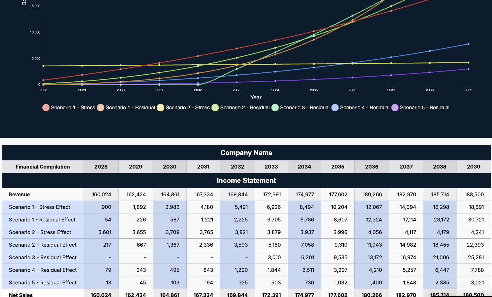
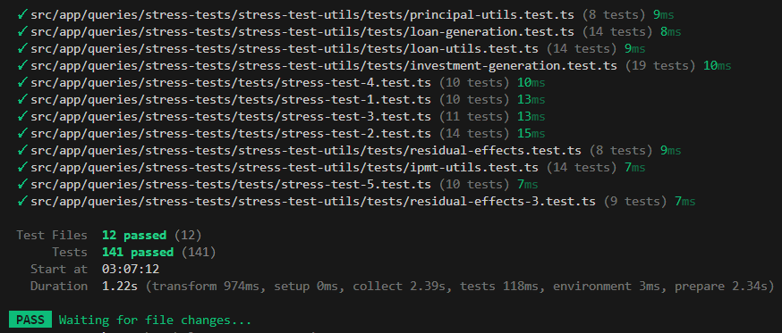

## Overview

As part of ICS 414: Software Engineering II, our team partnered with Spire, a financial consulting firm, to move an existing spreadsheet-based forecasting workflow into a web application.

I worked primarily on the backend and took ownership of the financial logic layer. What began as 'implement the spreadsheet' quickly became a systems problem: the spreadsheet contained undocumented assumptions, incomplete logic, and edge cases that were never formally handled. My role evolved into designing a backend that could replace the spreadsheet entirely—not just mirror it.

  

## What I Built

I designed and implemented the core backend logic that powers the forecasting and stress-testing system, including:

- A 12-year financial forecast engine supporting multiplier-based and rolling 3-year average methods
**Five stress-test models, including**:
  - Revenue return rate drops
  - Operating expense increases
  - Investment return changes (with reinvestment logic)
  - Loan and bond return variations
  - One-time event expenses with long-term residual impact
- Residual-effects modelling to capture compounded long-term financial impact
- A shared utility layer for loan simulation, investment growth, principal deltas, and residual calculations
- Defensive input validation and guardrails for invalid, missing, or out-of-range data
- API endpoints to expose forecasts and stress-test results
- A comprehensive Vitest test suite (140+ tests) covering edge cases and regression scenarios

## Engineering Challenges

This project was less about writing formulaes and more about formalising ambiguity.

**Some of the key challenges**:
- Spreadsheet logic contained fields that existed visually but did not affect calculations
- Several formulaes produced inconsistent or inflated results under stress scenarios
- Stress tests required consistent output shapes across unrelated financial models
- Edge cases (zero values, negative inputs, invalid years) caused silent failures
- Backend and frontend data models diverged mid-project, requiring careful isolation of responsibilities

I resolved these issues by defining clear invariants, modularising calculation logic, and validating every boundary explicitly rather than trusting upstream inputs.

## Testing & Reliability

A major focus of my work was correctness and long-term maintainability.

  <strong style="font-size: 24px; padding-top: 24px;">Vitest Results</strong>
   
  

I refactored the stress-test logic into reusable utilities and built a full test suite using Vitest, covering:
- Invalid inputs (NaN, negatives, out-of-range percentages)
- Zero and empty data scenarios
- Boundary conditions at the edges of the forecast window
- Consistency between baselines stressed, and residual outputs
This made the system predictable, testable, and safe to evolve—even as requirements shifted.

## Role & Ownership

On paper, roles were split between frontend and backend. In practice, I stepped into a backend lead role for financial logic and system structure.

**I**:
- Designed backend architecture and calculation flows
- Refactored legacy logic into maintainable utilities
- Wrote the majority of stress-test and forecasting code
- Identified and corrected logic errors in the original spreadsheet
- Established testing standards for the backend
- This wasn not assigned. I took ownership because the system needed it

## What I Learnt

Translating spreadsheets into systems exposes hidden assumptions
Correctness matters more than speed when financial logic is involved
Architecture clarity prevents downstream confusion
Ownership is assumed, not given
Carrying everything alone does not scale—and knowing when to stop matters

## Status

The repository remains private due to course and client constraints.

After the course concluded, I explored continuing the project as a standalone system, including discussions with peers about rebuilding the frontend and considering a full reimplementation using a different tech stack. Ultimately, I chose not to pursue a rewrite at that time, as my priorities shifted toward other academic and technical work.

The system remains a complete and functional backend implementation, and the architectural and testing work from this project continues to inform how I design data-heavy, reliability-critical systems.
