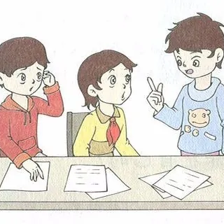
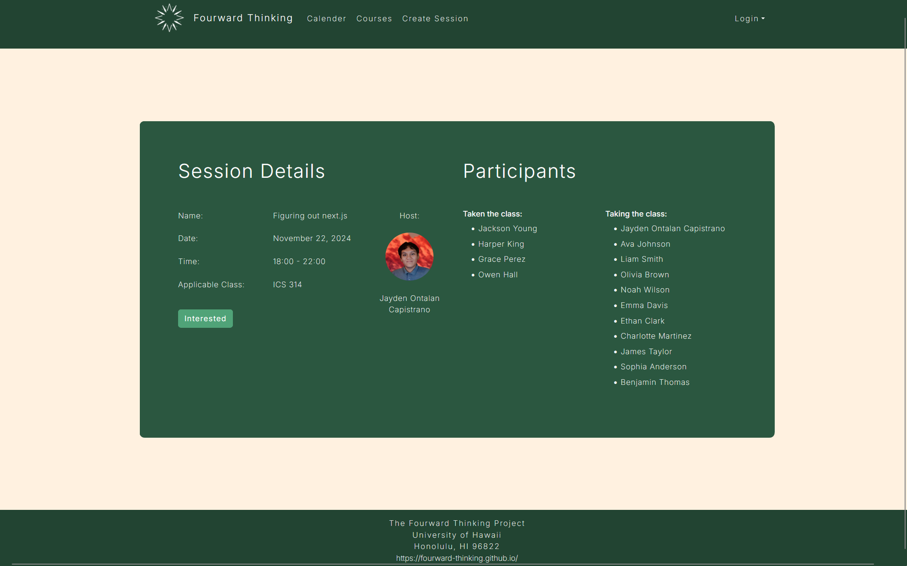

  

# Project Overview

Fourward Thinking is an application developed to help ICS students at the University of Hawai'i Manoa (UHM) connect and collaborate on study sessions. The application allows students to easily organize face-to-face study groups for specific courses, homework assignments, or project topics. The goal of the project is to enhance peer-to-peer collaboration and reduce the isolation students often experience while studying, leading to more efficient learning and better academic outcomes.

The app includes features like profile creation, study session proposal and scheduling, a real-time calendar view, and an interactive system that allows students to offer or request help with specific topics. It supports both planned study sessions for future dates and immediate help requests for impromptu study groups. The project is live on Vercel for public access.
My Role

As a key member of the development team, I contributed to both the frontend and backend of the project. Specifically, I worked on the HTML mockups for key pages, such as the Session Details Page and Create Session Page. These mockups were crucial in the early stages of the project to define the structure and flow of the user interface.

In addition to the mockups, I worked extensively on the backend and frontend implementation of the Create Session page, which allows students to propose study sessions by selecting courses, topics, and scheduling times. This involved integrating user inputs with the backend system, ensuring that data was properly stored, and implementing the necessary logic for real-time notifications to other students.

  <strong style="font-size: 24px; padding-top: 24px;">Create Session Page</strong>
   
  
   
  <strong style="font-size: 18px;">backend implemented</strong>

For the Session Details page, I had only finished a html mockup of the page. A backend implementation was not finished before Milestone three.

  <strong style="font-size: 24px; padding-top: 24px;">Session Details Page</strong>
   
  
   
  <strong style="font-size: 18px;">no backend implementation</strong>

Unfortunately, due to challenges with breaking down tasks into smaller, more manageable pieces, I was unable to meet the full implementation goals for Milestone two. Initially, the project was meant to be developed by 4-6 team members, but with one member absent from the start and another disappearing after Milestone 1, the workload fell heavily on myself and my remaining teammate.

The experience taught me the importance of breaking tasks into smaller, more achievable chunks and adhering to design patterns and Iterative Design and Project Management (IDPM). It became clear how easy it is to overestimate one’s ability to handle multiple complex tasks in a single branch of the project, leading to delays and inefficiencies.

# Insights and Learnings

Working on Fourward Thinking has been an incredible learning experience. One of the biggest takeaways was the importance of breaking down tasks into smaller, manageable pieces. During Milestone two, I encountered issues by taking on too much at once within a single branch, which hindered my progress. I quickly realised that adopting a more modular approach—where I tackled smaller tasks one at a time—would have been more effective.

In addition, the project emphasised the value of design patterns and how they can guide your development process. This was particularly relevant as I worked on the backend and frontend integration for the Create Session page. Learning how to structure my work around well-established patterns improved both my efficiency and the overall scalability of the project.

Another important lesson was the Iterative Design and Project Management (IDPM) approach. By breaking down tasks into smaller, more focused deliverables, I could make incremental progress instead of attempting to implement large, unmanageable features all at once.

While we faced setbacks due to the absence of team members and difficulty in meeting milestones, these challenges have provided invaluable insights into teamwork, time management, and project management strategies.
Future Plans

Despite the setbacks, my teammate and I are committed to seeing the project through to completion. We plan to:

- Refine and Complete Features: Focus on polishing the remaining features, including backend functionalities and frontend design improvements.
- User Feedback Integration: Act on the feedback received from the UHM community to enhance usability and user experience.
- Extend Functionality: Add additional features such as improved filtering for courses, integration with a text messaging interface for notifications, and a rating system for study sessions.

Once the project is complete, I will update this page with further progress and final outcomes.
Challenges & Takeaways

- Collaboration: Working with fewer team members than originally planned meant taking on more responsibility, which leads to challenges in meeting milestones.
- Task Management: The importance of properly managing task size and scope became starkly clear. Smaller, more focused tasks help reduce overwhelm and improve progress.
- Project Management: I developed an understanding of how to handle unexpected challenges, manage time effectively,to adapt to dynamic needs.
- Procrastination: In the end, less group members does not mean an application cannot be finished. Procrastination was a factor during the the development of this application.

Feel free to check us out:
- [The Fourward Thinking app](https://fourward-thinking-application.vercel.app)
- [Our Organisation page](https://github.com/fourward-thinking)
- [Our Project Homepage](https://fourward-thinking.github.io/)
- [Kaenaokalani Sylva - Fourward Thinking Group Member](https://kaenasylva.github.io/)