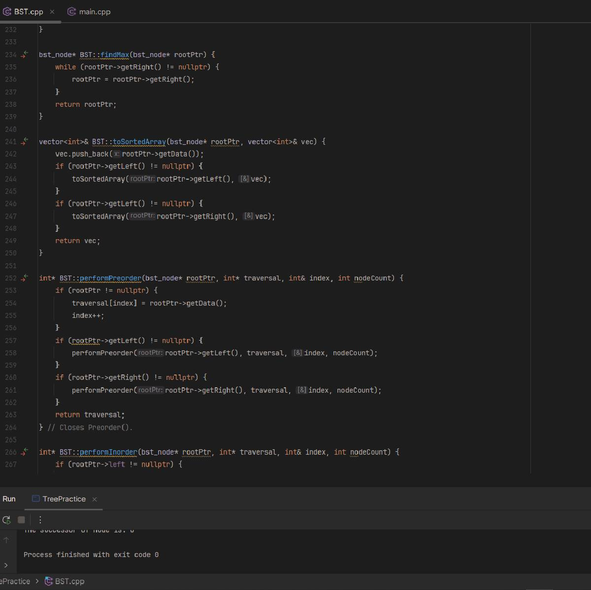

  

## Project Overview

This project involved creating a Binary Search Tree (BST) implementation in C++ to practice working with tree data structures. I designed this BST to efficiently handle basic operations such as insertion, traversal, and searching. Key features included multiple traversal methods (preorder, inorder, and postorder) and utility functions to find successors, count nodes, and determine tree depth. This implementation aimed to provide a robust tool for understanding tree operations and their applications, including efficiently managing and querying hierarchical data. The BST's efficiency in handling these operations adds significant value to the project.

## Key Features

- **Multiple Traversal Methods**: Implemented preorder, inorder, and postorder traversal techniques to explore tree nodes in different orders.
- **Utility Functions**: Added functions to find successors, count nodes, and determine the depth of the tree.
- **Modular Design**: Used a modular approach to break down functionalities into distinct methods for insertion, traversal, and balance-checking.
- **Tree Balancing**: Integrated features to handle tree balancing and maintain efficient operations.
- **Node Management**: Included code to manage node counts and tree depths for enhanced understanding of the BST structure and performance.

## Role and Responsibilities

In this project, I took on the role of the sole developer, handling all features of the BST's design and implementation. I was responsible for creating the core data structures, including the BST and bst_node classes, and implementing critical functions such as node insertion, traversal methods, and key search. I implemented a modular approach by breaking functionalities into distinct insertion, traversal, and balance-checking methods. This organization enhanced code readability and maintenance. I included features to handle tree balancing and successor finding, ensuring the BST operated efficiently. I also wrote code to manage node counts and depths, which helped me understand the tree's structure and performance.

## Lessons Learned

This project gave me significant insights into tree data structures and their practical implementation. I learned the importance of modular design in managing complex data structures, which made it easier to develop and test individual components of the BST. The project emphasized the value of efficient algorithms for tree operations, such as traversal and node counting, and highlighted the importance of maintaining balance within the tree to optimize performance. I also developed a deeper understanding of memory management in C++, including dynamic memory allocation and deallocation. Overall, this project provided a solid foundation in tree data structures and prepared me for more advanced topics in computer science.

## Future Plans

I plan to enhance the BST implementation with the following features:

- **Predecessor Finding**: Implement functionality to find and print the predecessor of a given node.
- **Tree Balance Checking**: Add functionality to check if the tree is balanced.
- **Array Conversions**: Implement conversions between sorted arrays and BSTs.
- **BST Validation**: Add functionality to check the validity of the BST.
- **Lowest Common Ancestor**: Implement functions to find and print the lowest common ancestor of two nodes.
- **Leaf Node Count**: Add functionality to count and print the number of leaf nodes.

These enhancements will improve the BST's functionality and provide more tools for managing and querying tree data structures.

Feel free to check out the project or reach out if you have any questions!

---

For more details, visit Project Repository.
