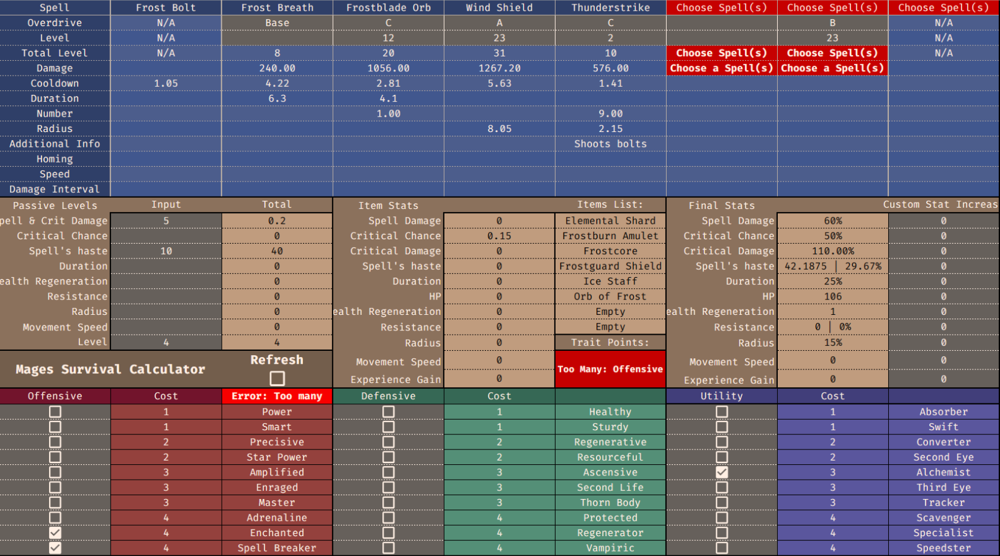
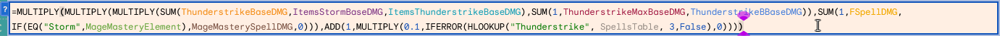

  

## Project Overview

This project was an advanced spreadsheet calculator for a mobile game I developed, designed to compute any spell's stats based on stats. Users can make their selections for their mage type, spells, spell paths, items, traits, and passive traits. The calculator will perform detailed calculations to determine the damage output for active spells. This project provides players with a potent tool to optimise stringent gameplay experiences by accurately calculating the damage and other spell stats based on their configurations.

## My Role

My role in this project was pivotal, as I was exclusively responsible for its development. This responsibility encompassed designing the backend systems for managing items, spells, and calculations and creating the frontend interface for user input. By adopting a modular approach to data utilisation, I enhanced both scalability and ease of maintenance. I crafted distinct backend modules for different data types (e.g., items, spells) and integrated them seamlessly into the front end to streamline updates and ensure reliable operation. I incorporated robust error-checking operations in this modular approach to validate user inputs and provide feedback to users when constraints (like item limits) were exceeded. Furthermore, I oversaw the design and layout, implementing colour codes for input fields and categorising data for clarity.

## Key Features

- **Dynamic Spell Calculations**: Computes damage output and other spell stats based on user selections.
- **Modular Design**: Separate modules for different data types (e.g., items, spells) for easier updates and maintenance.
- **User Feedback**: Real-time feedback for invalid inputs and constraints.

## Insights and Learnings

  

Working on this project gave me valuable insights into managing data and using modular design principles. I realised how important it is to break down complex calculations into manageable parts. This approach made updating and maintaining each component much more accessible than dealing with a vast, unwieldy formula. I also saw firsthand the impact of thorough error-checking and input validation on improving user experience and preventing mistakes. The project highlighted scalability and clear visual organisation for effective software design. Even though I put the project on hold due to a potential overhaul in the game's item system, the skills and techniques I developed will help handle and scale complex data-driven applications.

## Future Plans

- **Revise and Update**: Plan to revisit the project once the game's item system is updated.
- **Enhance Features**: Consider adding more features based on user feedback and evolving needs.

Feel free to check out the project or reach out if you have any questions!

---

For more details, you can access the [spreadsheet here](https://docs.google.com/spreadsheets/d/19tHauHYIDEdJ4v4bz1OhWK5OPHvkaEYyTbK8K9yhvp0/edit?usp=sharing).
